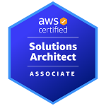

<h1 align="center">Greetings, I'm <a>Mehmet Yunus</a>  
 Welcome to My GitHub Page</h1>

- 🔭 Currently practicing **AWS & DevOps**
- 🌱 Cloud computing is my passion, DevOps is my realm
- 💬 Dedicated to learn new programming languages, apps, tools and libraries in software development
- ⚡ A personality who seeks to push beyond boundaries to realize his dreams and explore the future  && I like to benefit from and cooperate with IT connoisseurs

## SKILLS & TOOLS

              

## CERTIFICATIONS

</a>

## AWS Projects

| Name                  |                                                                                              Description                                                                                              |
| --------------------- | :---------------------------------------------------------------------------------------------------------------------------------------------------------------------------------------------------: |
| Flask-Web-Application |                                     [Handling Routes, Templates, Forms and SQL with Flask Web Application](https://github.com/Yunus-Altay/Flask-Web-Application)                                      |
| CFN-Web-App-HandsOn   |                            [deploying an application environment consisting of ASGw/ELB in AWS with configuration parameters](https://github.com/Yunus-Altay/CFN-ASG-ALB)                             |
| Project-101           |                      [Kittens Carousel Static Website deployed on AWS EC2 using Cloudformation](https://github.com/Yunus-Altay/Project-101-kittens-carousel-static-website-ec2)                       |
| Project-102           |            [Roman Numerals Converter Application (Python Flask) deployed on AWS EC2 with Cloudformation and AWS CLI](https://github.com/Yunus-Altay/Project-102-Roman-Numerals-Converter)             |
| Project-103           | [Phonebook Application (Python Flask) deployed on AWS Application Load Balancer with Auto Scaling and RDS using AWS Cloudformation](https://github.com/Yunus-Altay/Project-103-Phonebook-Application) |
| Project-104           |           [Kittens Carousel Static Website deployed on AWS Cloudfront, S3 and Route 53 using Cloudformation](https://github.com/Yunus-Altay/Project-104-kittens-carousel-static-web-s3-cf)            |
| Project-501           |                 [Capstone Project - Blog Page App (Django) on AWS Environment](https://github.com/Yunus-Altay/Project-501-Capstone-Project-Blog-Page-App--Django--on-AWS-Environment)                 |

## DevOps Projects

|  Name                  |                                                    Description                                                                       |
| ----------------------- | :---------------------------------------------------------------------------------------------------------------------------------------: |
|Project-201             |[Phonebook Application (Python Flask) deployed on AWS Application Load Balancer with Auto Scaling and Relational Database Service using Terraform](https://github.com/Yunus-Altay/Project-201-Phonebook-Application-Terraform)|
|Project-T01             |[Capstone Project - Blog Page App (Django) on AWS Environment using Terraform](https://github.com/Yunus-Altay/Capstone_project_blog_page_app_using_terraform)|
|Project-202             |[Dockerization of Bookstore Web API (Python Flask) with MySQL](https://github.com/Yunus-Altay/202-dockerization-bookstore-api-on-python-flask-mysql.git)|
|Project-203             |[Microservice Architecture for Phonebook Web Application (Python Flask) with MySQL using Kubernetes](https://github.com/Yunus-Altay/203-Kubernetes-Microservice-Phonebook.git)|